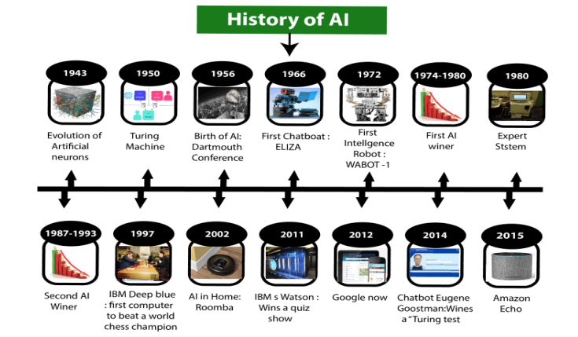

---

## **1. Introduction to Artificial Intelligence (AI)**

### **1.1 Meaning of Artificial Intelligence**

Artificial Intelligence (AI) is a field of computer science that focuses on **making machines intelligent**.

**Very simple meaning:**
AI means teaching a machine **how to think, learn, and decide** just like a human.

Humans use their brain to think and decide. AI gives a **digital brain** to machines.

---

### **1.2 Definition of Artificial Intelligence**

**Basic Definition:**
Artificial Intelligence is the ability of a machine to perform tasks that normally require human intelligence.

**Standard exam definition:**

> Artificial Intelligence is a branch of computer science that deals with the creation of intelligent machines that can think, learn, reason, and act like humans.

**Key words to remember:**

* Intelligent machines
* Learning
* Reasoning
* Decision making
* Problem solving

---

### **1.3 Why Artificial Intelligence is Needed**

AI is needed because humans:

* Make mistakes
* Get tired
* Cannot process huge data fast

AI systems:

* Work continuously without fatigue
* Handle massive data quickly
* Give accurate results
* Reduce human effort

**Real-life reason:**
Doctors use AI to detect diseases faster. Drivers use AI for safer driving.

---

### **1.4 Goals of Artificial Intelligence**

AI aims to:

1. **Replicate human intelligence**
2. **Solve complex problems**
3. **Connect perception and action**
4. **Perform tasks requiring intelligence**, such as:

   * Playing chess
   * Driving a car
   * Medical diagnosis
   * Proving theorems
5. **Create systems that can learn and improve by themselves**

---

### **1.5 Characteristics of Artificial Intelligence**

An AI system shows the following characteristics:

* Learning from experience
* Reasoning logically
* Solving problems
* Understanding language
* Perceiving the environment
* Making decisions

If a system shows these features, we call it an **AI system**.

---

### **1.6 What Comprises Artificial Intelligence**

AI does not depend on a single subject. It combines many fields.

**Main disciplines involved:**

* Mathematics (logic, algorithms)
* Computer Science (programming, data structures)
* Biology (brain, neurons)
* Psychology (human behavior)
* Statistics (data analysis)
* Neuroscience

**Simple idea:**
AI copies how humans **think, learn, and act** by studying these fields.

---

### **1.7 Advantages of Artificial Intelligence**

AI provides many advantages:

1. **High Accuracy** – reduces human errors
2. **High Speed** – processes data faster than humans
3. **Reliability** – gives consistent results
4. **Works in Risky Areas** – mines, space, bombs
5. **Automation** – reduces manual work
6. **Digital Assistance** – chatbots, voice assistants

---

### **1.8 Disadvantages of Artificial Intelligence**

AI also has limitations:

1. **High Cost** – expensive hardware and maintenance
2. **No Emotions** – cannot understand feelings
3. **No Creativity** – cannot imagine new ideas
4. **Dependency on Machines** – humans rely too much on AI
5. **Limited Thinking** – works only within training

---

### **1.9 History of Artificial Intelligence (Short but Important)**

* **1950:** Alan Turing proposed the Turing Test
* **1956:** John McCarthy coined the term "Artificial Intelligence"
* **1970s–1980s:** Expert systems developed
* **1997:** IBM Deep Blue defeated chess champion
* **2011–Present:** AI boom (deep learning, big data)

**Exam Tip:** Remember **Turing Test** and **John McCarthy**.

---

### **1.10 Types of Artificial Intelligence (Introduction Level)**

#### **Based on Capabilities**

1. **Narrow AI (Weak AI)**

* Performs one specific task
* Examples: Siri, Google Assistant, chess programs

2. **General AI**

* Performs any task like a human
* Does not exist yet

3. **Super AI**

* Smarter than humans
* Hypothetical concept

---

### **1.11 Applications of Artificial Intelligence**

AI is used in many fields:

* Healthcare (disease detection)
* Education (smart tutors)
* Finance (fraud detection)
* Gaming (chess, strategy games)
* Transportation (self-driving cars)
* Agriculture (crop monitoring)
* E-commerce (recommendations)

---
