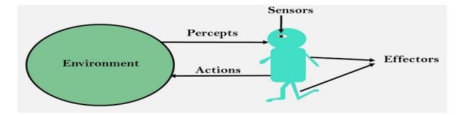
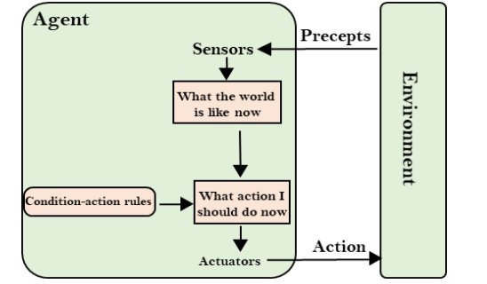
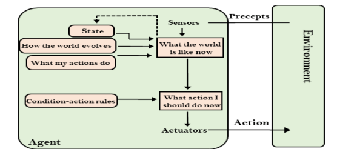
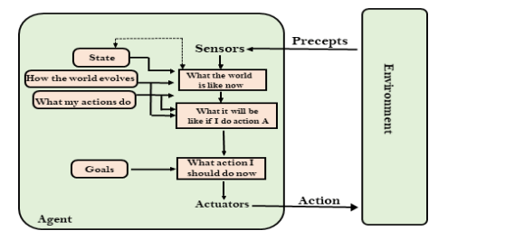
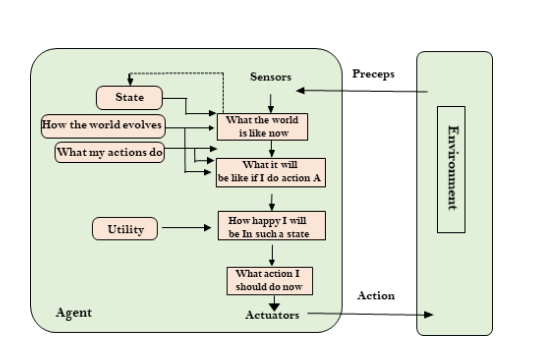
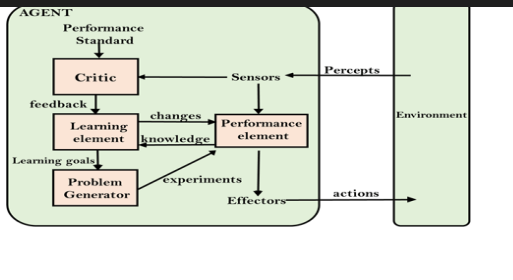
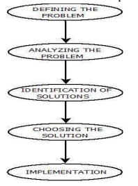

---

## **1. Introduction to Artificial Intelligence (AI)**

### **1.1 Meaning of Artificial Intelligence**

Artificial Intelligence (AI) is a field of computer science that focuses on **making machines intelligent**.

**Very simple meaning:**
AI means teaching a machine **how to think, learn, and decide** just like a human.

Humans use their brain to think and decide. AI gives a **digital brain** to machines.

---

### **1.2 Definition of Artificial Intelligence**

**Basic Definition:**
Artificial Intelligence is the ability of a machine to perform tasks that normally require human intelligence.

**Standard exam definition:**

> Artificial Intelligence is a branch of computer science that deals with the creation of intelligent machines that can think, learn, reason, and act like humans.

**Key words to remember:**

* Intelligent machines
* Learning
* Reasoning
* Decision making
* Problem solving

---

### **1.3 Why Artificial Intelligence is Needed**

AI is needed because humans:

* Make mistakes
* Get tired
* Cannot process huge data fast

AI systems:

* Work continuously without fatigue
* Handle massive data quickly
* Give accurate results
* Reduce human effort

**Real-life reason:**
Doctors use AI to detect diseases faster. Drivers use AI for safer driving.

---

### **1.4 Goals of Artificial Intelligence**

AI aims to:

1. **Replicate human intelligence**
2. **Solve complex problems**
3. **Connect perception and action**
4. **Perform tasks requiring intelligence**, such as:

   * Playing chess
   * Driving a car
   * Medical diagnosis
   * Proving theorems
5. **Create systems that can learn and improve by themselves**

---

### **1.5 Characteristics of Artificial Intelligence**

An AI system shows the following characteristics:

* Learning from experience
* Reasoning logically
* Solving problems
* Understanding language
* Perceiving the environment
* Making decisions

If a system shows these features, we call it an **AI system**.

---

### **1.6 What Comprises Artificial Intelligence**

AI does not depend on a single subject. It combines many fields.

**Main disciplines involved:**

* Mathematics (logic, algorithms)
* Computer Science (programming, data structures)
* Biology (brain, neurons)
* Psychology (human behavior)
* Statistics (data analysis)
* Neuroscience

**Simple idea:**
AI copies how humans **think, learn, and act** by studying these fields.

---

### **1.7 Advantages of Artificial Intelligence**

AI provides many advantages:

1. **High Accuracy** – reduces human errors
2. **High Speed** – processes data faster than humans
3. **Reliability** – gives consistent results
4. **Works in Risky Areas** – mines, space, bombs
5. **Automation** – reduces manual work
6. **Digital Assistance** – chatbots, voice assistants

---

### **1.8 Disadvantages of Artificial Intelligence**

AI also has limitations:

1. **High Cost** – expensive hardware and maintenance
2. **No Emotions** – cannot understand feelings
3. **No Creativity** – cannot imagine new ideas
4. **Dependency on Machines** – humans rely too much on AI
5. **Limited Thinking** – works only within training

---

### **1.9 History of Artificial Intelligence (Short but Important)**

* **1950:** Alan Turing proposed the Turing Test
* **1956:** John McCarthy coined the term "Artificial Intelligence"
* **1970s–1980s:** Expert systems developed
* **1997:** IBM Deep Blue defeated chess champion
* **2011–Present:** AI boom (deep learning, big data)

**Exam Tip:** Remember **Turing Test** and **John McCarthy**.

---

### **1.10 Types of Artificial Intelligence (Introduction Level)**

#### **Based on Capabilities**

1. **Narrow AI (Weak AI)**

* Performs one specific task
* Examples: Siri, Google Assistant, chess programs

2. **General AI**

* Performs any task like a human
* Does not exist yet

3. **Super AI**

* Smarter than humans
* Hypothetical concept

---

### **1.11 Applications of Artificial Intelligence**

AI is used in many fields:

* Healthcare (disease detection)
* Education (smart tutors)
* Finance (fraud detection)
* Gaming (chess, strategy games)
* Transportation (self-driving cars)
* Agriculture (crop monitoring)
* E-commerce (recommendations)

---

## **2. Agents and Environments**

Artificial Intelligence is defined as the study of **rational agents operating in an environment**.

An agent senses the environment, decides what to do, and performs actions to achieve its goal.

---

## **2.1 Agents in Artificial Intelligence**

### **Definition of an Agent (PDF-Exact Meaning)**

An **agent** is anything that:

* **Perceives** its environment through **sensors**
* **Acts** upon the environment through **actuators**

👉 If something can sense and act, it is an agent.

---

### **Agent–Environment Interaction**

An agent always works inside an environment.

**Step-by-step interaction:**

1. Environment produces information
2. Agent senses information using sensors
3. Agent processes information
4. Agent selects an action
5. Agent performs action using actuators
6. Environment changes
7. Cycle repeats continuously

This continuous loop makes an agent intelligent.

---

### **Sensors (PDF-Based)**

A **sensor** detects changes in the environment and sends information to the agent.

**Examples:**

* Camera
* Microphone
* Infrared sensor
* Keyboard

Without sensors, the agent cannot observe the environment.

---

### **Actuators (PDF-Based)**

An **actuator** converts energy into motion or action.

**Examples:**

* Motors
* Wheels
* Gears
* Speakers

Actuators allow the agent to perform actions.

---

### **Effectors (PDF Term)**

Effectors are the parts of the agent that **directly affect the environment**.

**Examples:**

* Arms
* Legs
* Wheels
* Display screen

---

## **2.3 Types of AI Agents (VERY IMPORTANT)**

The PDF classifies agents into **five types** based on intelligence and capability.

---

### **1. Simple Reflex Agent**

A **Simple Reflex Agent**:

* Takes action based only on the **current percept**
* Ignores past percept history
* Uses **condition–action rules**

**Working idea (child-simple):**
IF condition is true → DO action

**Example from PDF:**

* Room cleaner agent

  * IF dirt detected → Clean

**Key Characteristics:**

* No memory
* No learning
* Works only in **fully observable environments**

**Limitations (PDF points):**

* Very limited intelligence
* Cannot handle changes in environment
* Fails in partially observable environments

---

### **2. Model-Based Reflex Agent**

A **Model-Based Reflex Agent** improves over the simple reflex agent.

**Why needed?**
Sometimes the agent cannot see the full environment.

**Main Components (PDF Keywords):**

1. **Model** – Knowledge of how the world works
2. **Internal State** – Stores information from past percepts

**How it works:**

* Uses percept history
* Updates internal state
* Decides action using model

**Capabilities:**

* Works in **partially observable environments**
* Tracks the current situation

---

### **3. Goal-Based Agent**

A **Goal-Based Agent** knows:

* Current state
* Desired goal state

**PDF Concept:**
Current state alone is not enough → goal information is required.

**How it works:**

* Considers different possible actions
* Chooses actions that lead to the goal
* Uses **searching and planning**

**Important Keyword:**

* Proactive agent

**Example:**

* Path-finding robot
* Game-playing agent

---

### **4. Utility-Based Agent**

A **Utility-Based Agent** selects the **best action**, not just any action that reaches the goal.

**PDF Concept:**
When multiple actions achieve the goal, the agent chooses the one with **maximum utility**.

**Utility Function:**

* Maps a state to a real number
* Higher value = better outcome

**Advantages:**

* Handles trade-offs
* Chooses most efficient solution

---

### **5. Learning Agent**

A **Learning Agent** improves its performance over time using experience.

**PDF Components (VERY IMPORTANT):**

1. **Performance Element** – Selects actions
2. **Learning Element** – Improves performance
3. **Critic** – Provides feedback
4. **Problem Generator** – Suggests new experiences

**Key Feature:**

* Learns automatically
* Adapts to environment

---

## **Agent Environment in AI (PDF-Based)**

An **environment** is everything surrounding the agent but not part of the agent itself.

The environment:

* Provides percepts
* Responds to agent actions
* Can be unpredictable (non-deterministic)

---

## **1. Rational Agent**

### **1.1 What is a Rational Agent?**

A **rational agent** is an agent that always chooses the action that gives the **best expected result** according to a given performance measure.

**Key idea (simple):**
A rational agent always tries to **do the best possible thing** using what it knows.

---

### **1.2 Rational Action**

An action is called **rational** when it:

* Maximizes the performance measure
* Uses the complete percept sequence
* Uses prior knowledge of the environment
* Chooses the best available action

👉 Rational does **not** mean perfect. The agent may have limited knowledge.

---

### **1.3 Factors that Decide Rationality**

Rationality depends on four things:

1. **Performance Measure** – Defines success
2. **Percept Sequence** – All perceptions received so far
3. **Prior Knowledge** – What the agent already knows
4. **Available Actions** – Actions the agent can perform

---

### **1.4 Performance Measure**

A **performance measure** evaluates how well an agent is doing.

**Example (Vacuum Cleaner Agent):**

* Clean floor
* Less energy usage
* Less time

---

### **1.5 PEAS Representation (VERY IMPORTANT)**

PEAS describes the **task environment** of an agent.

**PEAS = Performance measure, Environment, Actuators, Sensors**

#### **Example 1: Vacuum Cleaner Agent**

* **P:** Cleanliness, time, energy
* **E:** Rooms, dirt
* **A:** Move left, move right, suck
* **S:** Dirt sensor, location sensor

#### **Example 2: Self-Driving Taxi**

* **P:** Safety, speed, comfort, legality
* **E:** Roads, traffic, pedestrians
* **A:** Steering, brakes, accelerator
* **S:** Cameras, GPS, radar

---

## **2. Nature of Environments**

Environments are classified based on properties from the agent’s point of view.

---

### **2.1 Fully Observable vs Partially Observable**

* **Fully Observable:** Agent senses the complete environment
* **Partially Observable:** Agent senses incomplete information

**Examples:**

* Chess → Fully observable
* Driving → Partially observable

---

### **2.2 Deterministic vs Stochastic**

* **Deterministic:** Action gives one fixed result
* **Stochastic:** Action outcome is uncertain

---

### **2.3 Episodic vs Sequential**

* **Episodic:** Each action is independent
* **Sequential:** Current action affects future actions

---

### **2.4 Static vs Dynamic**

* **Static:** Environment does not change while thinking
* **Dynamic:** Environment changes continuously

---

### **2.5 Discrete vs Continuous**

* **Discrete:** Finite states and actions
* **Continuous:** Infinite states or actions

---

### **2.6 Single-Agent vs Multi-Agent**

* **Single-Agent:** Only one agent exists
* **Multi-Agent:** Multiple agents interact

---

### **2.7 Known vs Unknown**

* **Known:** Agent knows how actions affect environment
* **Unknown:** Agent must learn environment behavior

---

## **3. Structure of Agents**

### **3.1 Agent Structure**

> **Agent = Architecture + Agent Program**

---

### **3.2 Architecture**

Architecture is the **hardware or software platform** on which the agent runs.

**Examples:**

* Robot body
* Computer system

---

### **3.3 Agent Program**

The agent program implements the agent function and decides actions.

---

### **3.4 Agent Function**

The agent function maps percept sequences to actions.

**Representation:**

f : P* → A

---

## **4. Problem-Solving Agents**\

### **4.1 What is a Problem-Solving Agent?**

A **problem-solving agent** is a **goal-based agent** that finds a sequence of actions to reach a goal.

It uses **search techniques**.

---

### **4.2 Characteristics of Problem-Solving Agents**

* Single-agent environment
* Deterministic
* Fully observable
* Sequential

---

### **4.3 Problem Formulation**

A problem is defined using five components:

1. **Initial State** – Starting point
2. **Actions** – Possible moves
3. **Transition Model** – Result of actions
4. **Goal Test** – Checks goal state
5. **Path Cost** – Cost of action sequence

---

### **4.4 Steps in Problem Solving**

1. Formulate goal
2. Formulate problem
3. Search for solution
4. Execute solution

---

### **4.5 Examples of Problem-Solving Tasks**

* 8-Puzzle problem
* Water Jug problem
* Tower of Hanoi
* Travelling Salesman Problem
* Chess

---

### **4.6 Measuring Search Performance**

* **Completeness** – Finds solution if one exists
* **Optimality** – Finds best solution
* **Time Complexity** – Time required
* **Space Complexity** – Memory required

---

