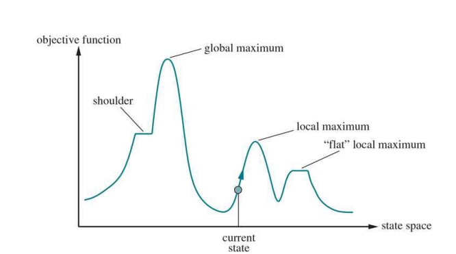
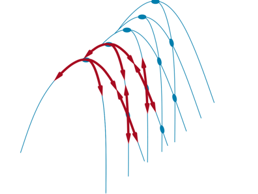
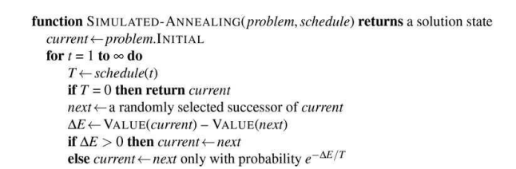

# Unit-2 Problem Solving

---

# **1. Informed Search Algorithms**

---

## **1.1 Introduction to Informed Search Algorithms**

Informed search algorithms are an improvement over uninformed search algorithms.

* Uninformed search algorithms search the entire search space without any additional knowledge.
* Informed search algorithms use **extra knowledge** such as:

  * Distance from the goal
  * Path cost
  * Information on how to reach the goal node
* This knowledge helps the agent:

  * Explore fewer nodes
  * Reach the goal more efficiently
* These algorithms are very useful for **large search spaces**
* Since they use heuristics, they are also called **heuristic search algorithms**

---

## **1.2 Heuristic Search**

### **Heuristic Function**

* A heuristic is a function used in informed search
* It finds the **most promising path**
* It takes the **current state** as input
* It produces an **estimate of how close the agent is to the goal**
* Represented as:

```
h(n)
```

Where:

* `n` is the current node
* `h(n)` estimates the cost of the optimal path from `n` to the goal
* The value of `h(n)` is always **positive**

### **Properties**

* Heuristic methods may not always give the best solution
* They guarantee a **good solution in reasonable time**
* Heuristic function estimates closeness to the goal

---

## **1.3 Admissibility of Heuristic Function**

A heuristic is admissible if:

```
h(n) ≤ h*(n)
```

Where:

* `h(n)` = heuristic cost
* `h*(n)` = estimated (actual optimal) cost

This means:

* Heuristic cost should be **less than or equal to** the actual cost

---

## **1.4 Pure Heuristic Search**

Pure heuristic search is the **simplest form** of heuristic search.

### **Characteristics**

* Nodes are expanded based only on `h(n)`
* Uses two lists:

  * **OPEN list** → nodes not yet expanded
  * **CLOSED list** → nodes already expanded

### **Working**

* Select node with lowest heuristic value
* Expand it
* Move it to CLOSED list
* Add successors to OPEN list
* Continue until goal state is found

---

## **1.5 Types of Informed Search Algorithms**

Two main informed search algorithms are discussed:

1. **Best First Search (Greedy Search)**
2. **A* Search Algorithm**

---

## **1.6 Best-First Search Algorithm (Greedy Search)**

### **Definition**

* Always selects the path that appears best at the moment
* Combines features of **DFS** and **BFS**
* Uses heuristic function to guide search

### **Evaluation Function**

```
f(n) = h(n)
```

Where:

* `h(n)` = estimated cost from node `n` to the goal

### **Implementation**

* Implemented using a **priority queue**

---

### **Algorithm (Steps)**

1. Place the starting node in the OPEN list
2. If OPEN list is empty, stop and return failure
3. Remove node `n` from OPEN with lowest `h(n)` and place it in CLOSED
4. Expand node `n` and generate successors
5. If any successor is goal, return success
6. Otherwise:

   * Evaluate successors
   * Add unvisited nodes to OPEN list
7. Repeat from Step 2


---

### **Advantages**

* Combines benefits of BFS and DFS
* More efficient than BFS and DFS

---

### **Disadvantages**

* Can behave like DFS in worst case
* Can get stuck in loops
* Not optimal

---

### **Example (Greedy Best-First Search)**

* Nodes expanded using `f(n) = h(n)`
* Uses OPEN and CLOSED lists

Final solution path:

```
S → B → F → G
```

---

### **Complexity**

* **Time Complexity:** `O(b^m)`
* **Space Complexity:** `O(b^m)`
* `b` = branching factor
* `m` = maximum depth

---

### **Properties**

* **Complete:** No
* **Optimal:** No

---

## **1.7 A* Search Algorithm**

### **Definition**

* Most commonly known form of best-first search
* Uses:

  * Heuristic function `h(n)`
  * Cost to reach node `g(n)`
* Combines features of:

  * Uniform Cost Search
  * Greedy Best-First Search

---

### **Evaluation Function**

```
f(n) = g(n) + h(n)
```

Where:

* `g(n)` = cost from start to node `n`
* `h(n)` = estimated cost to goal

---

### **Characteristics**

* Expands fewer nodes
* Finds shortest path
* Terminates when goal node is found

---

### **Algorithm (Steps)**

1. Place starting node in OPEN list
2. If OPEN list is empty, return failure
3. Select node with smallest `f(n)`

   * If it is goal, return success
4. Expand node and generate successors
5. For each successor:

   * Compute evaluation function
   * Add or update OPEN list
6. Move expanded node to CLOSED
7. Repeat from Step 2

---

### **Example (A* Search)**

Using `f(n) = g(n) + h(n)`

Final optimal path:

```
S → A → C → G
```

Cost:

```
6
```

---

### **Points to Remember**

* Returns first occurring path
* Does not search remaining paths
* Efficiency depends on heuristic quality
* Expands nodes satisfying:

```
f(n) ≤ f(goal)
```

---

### **Completeness**

A* is complete if:

* Branching factor is finite
* Cost of every action is fixed

---

### **Optimality Conditions**

A* is optimal if:

1. Heuristic is **admissible**
2. Heuristic is **consistent** (for graph search)

---

### **Advantages**

* Optimal
* Complete
* Solves complex problems

---

### **Disadvantages**

* High memory requirement
* Stores all generated nodes
* Not practical for very large problems

---

### **Complexity**

* **Time Complexity:** `O(b^d)`
* **Space Complexity:** `O(b^d)`
* `d` = depth of solution

---

## **Final Result**

* Informed search uses heuristics to guide search
* Greedy Best-First Search is fast but not optimal
* A* Search is optimal and complete when conditions are met
* Heuristic quality directly affects performance

---

# **2. Local Search and Optimization Problems**

---

## **2.1 Hill-Climbing Search**

### **What is Hill-Climbing Search**

* Hill-climbing search is a **local search algorithm**
* It keeps track of **only one current state**
* At each step:

  * It moves to the **neighboring state with the highest value**
* The search **stops** when:

  * No neighbor is better than the current state

---

### **Basic Idea (Child-Level Explanation)**

* Imagine standing on a hill in fog
* You can only see nearby steps
* You always step **upward**
* If you cannot go higher, you stop

---

### **Important Characteristics**

* Looks only at **immediate neighbors**
* Does **not look ahead**
* Uses very little memory
* Similar to greedy local search

---

### **Hill-Climbing and 8-Queens Problem**

#### **Problem**

* Place 8 queens on a chessboard
* No two queens should attack each other
* A queen attacks if it is:

  * In the same row
  * Same column
  * Same diagonal

---

#### **State Representation**

* Complete-state formulation
* Every state has 8 queens
* One queen per column

---

#### **Initial State**

* Chosen randomly

---

#### **Successor States**

* Move one queen within its column
* Total successors:

```
8 × 7 = 56
```

---

#### **Heuristic Function**

* Counts number of attacking queen pairs
* Goal state has:

```
h = 0
```

---

### **Why Hill-Climbing Fails**

#### **1. Local Maxima**

* A state that is better than neighbors
* But not the best overall
* Algorithm gets stuck

---

#### **2. Ridges**

* A series of local maxima
* All moves from each peak go downhill
* Hard for greedy algorithms

---

#### **3. Plateaus**

* Flat areas in state space
* No clear direction to move
* Algorithm may wander endlessly

---

### **Performance on 8-Queens**

* Solves only **14%** of cases
* Gets stuck **86%** of the time
* Average steps:

  * Success: 4
  * Failure: 3
* State space size:

```
8^8 ≈ 17 million
```

---

### **Sideways Moves**

* Move with same heuristic value
* Helps escape plateaus
* Must be limited to avoid infinite loops
* Limiting sideways moves increases success to **94%**

---

### **Variants of Hill-Climbing**

* Stochastic hill climbing
* First-choice hill climbing
* Random-restart hill climbing

---

## **2.2 Simulated Annealing**

### **Why Simulated Annealing is Needed**

* Hill-climbing never allows downhill moves
* Random walk is very slow
* Simulated annealing combines both

---

### **Idea from Metallurgy**

* Heat metal → atoms move freely
* Slowly cool → atoms settle in best position

---

### **Simple Explanation**

* At the beginning:

  * Many bad moves are allowed
* Later:

  * Fewer bad moves are allowed
* This helps escape local maxima

---

### **How It Works**

* Picks a **random move**
* If move is better → always accept
* If move is worse → accept with probability

---

### **Probability Depends On**

* How bad the move is (ΔE)
* Temperature (T)

---

### **Key Properties**

* At high temperature:

  * Bad moves are allowed
* As temperature decreases:

  * Bad moves become unlikely

---

### **Mathematical Idea**

* Probability follows Boltzmann distribution:

```
e^(-ΔE / T)
```

---

### **Guarantee**

* If temperature decreases slowly enough:

  * Algorithm reaches global maximum with high probability

---

### **Applications**

* VLSI layout problems
* Factory scheduling
* Large-scale optimization tasks

---

## **2.3 Local Beam Search**

### **Basic Idea**

* Keeps track of **k states**, not one
* Starts with **k random states**

---

### **Algorithm Steps**

1. Generate k random initial states
2. Generate all successors of all k states
3. If any successor is goal → stop
4. Select the **k best successors**
5. Repeat

---

### **Why It Is Better Than Restart**

* Searches in parallel
* Shares information between states
* Bad paths are abandoned quickly

---

### **Important Difference**

* Random restart:

  * Searches are independent
* Local beam search:

  * States guide each other

---

### **Limitation**

* States may become too similar
* Loss of diversity
* Becomes slow hill climbing

---

## **2.3.1 Stochastic Beam Search**

### **Purpose**

* Fix lack of diversity in local beam search

---

### **How It Works**

* Successors chosen probabilistically
* Probability proportional to value
* Encourages diversity

---

## **2.4 Evolutionary Algorithms**

### **Basic Idea**

* Inspired by natural selection
* Works like biological evolution

---

### **Key Concepts**

* Population of individuals (states)
* Fittest individuals survive
* New individuals are created

---

### **Genetic Algorithm Representation**

* Each individual is a string
* Example: digit strings for 8-queens
* Each digit represents queen position

---

### **Main Components**

#### **1. Population**

* A group of candidate solutions

---

#### **2. Fitness Function**

* Measures quality of solution
* Higher fitness = better solution
* For 8-queens:

```
Max fitness = 28
```

---

#### **3. Selection**

* Individuals selected based on fitness
* Higher fitness → higher probability

---

#### **4. Recombination (Crossover)**

* Two parents combine
* A crossover point is chosen
* Parts are exchanged

---

#### **5. Mutation**

* Random change in offspring
* Each bit may flip with small probability
* Maintains diversity

---

#### **6. Elitism**

* Best parents carried to next generation
* Ensures fitness never decreases

---

### **Why Genetic Algorithms Work**

* Combine useful building blocks
* Use crossover and mutation
* Fitness improves over generations

---

### **Schema Concept**

* A schema is a pattern in a string
* Example:

```
246*****
```

* Instances of schema grow if fitness is high

---
Just watch there videos for these topics
[Local Search in Continuous Spaces](https://www.youtube.com/watch?v=g0lF_p_Zlmw&t=952s)
[Search with Nondeterministic Actions](https://www.youtube.com/watch?v=VUuPlQFSwwo)
[Search in Partially Observable Environments](https://www.youtube.com/watch?v=Nw95_WLDTco)
[Hill Climbing](https://www.youtube.com/watch?v=_ThdIOA9Lbk)
