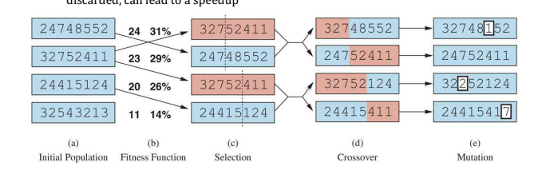

# Unit-2 Problem Solving

---

# **1. Informed Search Algorithms**

---

## **1.1 Introduction to Informed Search Algorithms**

Informed search algorithms are an improvement over uninformed search algorithms.

* Uninformed search algorithms search the entire search space without any additional knowledge.
* Informed search algorithms use **extra knowledge** such as:

  * Distance from the goal
  * Path cost
  * Information on how to reach the goal node
* This knowledge helps the agent:

  * Explore fewer nodes
  * Reach the goal more efficiently
* These algorithms are very useful for **large search spaces**
* Since they use heuristics, they are also called **heuristic search algorithms**

---

## **1.2 Heuristic Search**

### **Heuristic Function**

* A heuristic is a function used in informed search
* It finds the **most promising path**
* It takes the **current state** as input
* It produces an **estimate of how close the agent is to the goal**
* Represented as:

```
h(n)
```

Where:

* `n` is the current node
* `h(n)` estimates the cost of the optimal path from `n` to the goal
* The value of `h(n)` is always **positive**

### **Properties**

* Heuristic methods may not always give the best solution
* They guarantee a **good solution in reasonable time**
* Heuristic function estimates closeness to the goal

---

## **1.3 Admissibility of Heuristic Function**

A heuristic is admissible if:

```
h(n) ≤ h*(n)
```

Where:

* `h(n)` = heuristic cost
* `h*(n)` = estimated (actual optimal) cost

This means:

* Heuristic cost should be **less than or equal to** the actual cost

---

## **1.4 Pure Heuristic Search**

Pure heuristic search is the **simplest form** of heuristic search.

### **Characteristics**

* Nodes are expanded based only on `h(n)`
* Uses two lists:

  * **OPEN list** → nodes not yet expanded
  * **CLOSED list** → nodes already expanded

### **Working**

* Select node with lowest heuristic value
* Expand it
* Move it to CLOSED list
* Add successors to OPEN list
* Continue until goal state is found

---

## **1.5 Types of Informed Search Algorithms**

Two main informed search algorithms are discussed:

1. **Best First Search (Greedy Search)**
2. **A* Search Algorithm**

---

## **1.6 Best-First Search Algorithm (Greedy Search)**

### **Definition**

* Always selects the path that appears best at the moment
* Combines features of **DFS** and **BFS**
* Uses heuristic function to guide search

### **Evaluation Function**

```
f(n) = h(n)
```

Where:

* `h(n)` = estimated cost from node `n` to the goal

### **Implementation**

* Implemented using a **priority queue**

---

### **Algorithm (Steps)**

1. Place the starting node in the OPEN list
2. If OPEN list is empty, stop and return failure
3. Remove node `n` from OPEN with lowest `h(n)` and place it in CLOSED
4. Expand node `n` and generate successors
5. If any successor is goal, return success
6. Otherwise:

   * Evaluate successors
   * Add unvisited nodes to OPEN list
7. Repeat from Step 2


---

### **Advantages**

* Combines benefits of BFS and DFS
* More efficient than BFS and DFS

---

### **Disadvantages**

* Can behave like DFS in worst case
* Can get stuck in loops
* Not optimal

---

### **Example (Greedy Best-First Search)**

* Nodes expanded using `f(n) = h(n)`
* Uses OPEN and CLOSED lists

Final solution path:

```
S → B → F → G
```

---

### **Complexity**

* **Time Complexity:** `O(b^m)`
* **Space Complexity:** `O(b^m)`
* `b` = branching factor
* `m` = maximum depth

---

### **Properties**

* **Complete:** No
* **Optimal:** No

---

## **1.7 A* Search Algorithm**

### **Definition**

* Most commonly known form of best-first search
* Uses:

  * Heuristic function `h(n)`
  * Cost to reach node `g(n)`
* Combines features of:

  * Uniform Cost Search
  * Greedy Best-First Search

---

### **Evaluation Function**

```
f(n) = g(n) + h(n)
```

Where:

* `g(n)` = cost from start to node `n`
* `h(n)` = estimated cost to goal

---

### **Characteristics**

* Expands fewer nodes
* Finds shortest path
* Terminates when goal node is found

---

### **Algorithm (Steps)**

1. Place starting node in OPEN list
2. If OPEN list is empty, return failure
3. Select node with smallest `f(n)`

   * If it is goal, return success
4. Expand node and generate successors
5. For each successor:

   * Compute evaluation function
   * Add or update OPEN list
6. Move expanded node to CLOSED
7. Repeat from Step 2

---

### **Example (A* Search)**

Using `f(n) = g(n) + h(n)`

Final optimal path:

```
S → A → C → G
```

Cost:

```
6
```

---

### **Points to Remember**

* Returns first occurring path
* Does not search remaining paths
* Efficiency depends on heuristic quality
* Expands nodes satisfying:

```
f(n) ≤ f(goal)
```

---

### **Completeness**

A* is complete if:

* Branching factor is finite
* Cost of every action is fixed

---

### **Optimality Conditions**

A* is optimal if:

1. Heuristic is **admissible**
2. Heuristic is **consistent** (for graph search)

---

### **Advantages**

* Optimal
* Complete
* Solves complex problems

---

### **Disadvantages**

* High memory requirement
* Stores all generated nodes
* Not practical for very large problems

---

### **Complexity**

* **Time Complexity:** `O(b^d)`
* **Space Complexity:** `O(b^d)`
* `d` = depth of solution

---

## **Final Result**

* Informed search uses heuristics to guide search
* Greedy Best-First Search is fast but not optimal
* A* Search is optimal and complete when conditions are met
* Heuristic quality directly affects performance

---

# **2. Local Search and Optimization Problems**

---

## **2.1 Hill-Climbing Search**

### **What is Hill-Climbing Search**

* Hill-climbing search is a **local search algorithm**
* It keeps track of **only one current state**
* At each step:

  * It moves to the **neighboring state with the highest value**
* The search **stops** when:

  * No neighbor is better than the current state

---

### **Basic Idea (Child-Level Explanation)**

* Imagine standing on a hill in fog
* You can only see nearby steps
* You always step **upward**
* If you cannot go higher, you stop

---

### **Important Characteristics**

* Looks only at **immediate neighbors**
* Does **not look ahead**
* Uses very little memory
* Similar to greedy local search

---

### **Hill-Climbing and 8-Queens Problem**

#### **Problem**

* Place 8 queens on a chessboard
* No two queens should attack each other
* A queen attacks if it is:

  * In the same row
  * Same column
  * Same diagonal

---

#### **State Representation**

* Complete-state formulation
* Every state has 8 queens
* One queen per column

---

#### **Initial State**

* Chosen randomly

---

#### **Successor States**

* Move one queen within its column
* Total successors:

```
8 × 7 = 56
```

---

#### **Heuristic Function**

* Counts number of attacking queen pairs
* Goal state has:

```
h = 0
```

---

### **Why Hill-Climbing Fails**

#### **1. Local Maxima**

* A state that is better than neighbors
* But not the best overall
* Algorithm gets stuck

---

#### **2. Ridges**

* A series of local maxima
* All moves from each peak go downhill
* Hard for greedy algorithms

---

#### **3. Plateaus**

* Flat areas in state space
* No clear direction to move
* Algorithm may wander endlessly

---

### **Performance on 8-Queens**

* Solves only **14%** of cases
* Gets stuck **86%** of the time
* Average steps:

  * Success: 4
  * Failure: 3
* State space size:

```
8^8 ≈ 17 million
```

---

### **Sideways Moves**

* Move with same heuristic value
* Helps escape plateaus
* Must be limited to avoid infinite loops
* Limiting sideways moves increases success to **94%**

---

### **Variants of Hill-Climbing**

* Stochastic hill climbing
* First-choice hill climbing
* Random-restart hill climbing

---

## **2.2 Simulated Annealing**

### **Why Simulated Annealing is Needed**

* Hill-climbing never allows downhill moves
* Random walk is very slow
* Simulated annealing combines both

---

### **Idea from Metallurgy**

* Heat metal → atoms move freely
* Slowly cool → atoms settle in best position

---

### **Simple Explanation**

* At the beginning:

  * Many bad moves are allowed
* Later:

  * Fewer bad moves are allowed
* This helps escape local maxima

---

### **How It Works**

* Picks a **random move**
* If move is better → always accept
* If move is worse → accept with probability

---

### **Probability Depends On**

* How bad the move is (ΔE)
* Temperature (T)

---

### **Key Properties**

* At high temperature:

  * Bad moves are allowed
* As temperature decreases:

  * Bad moves become unlikely

---

### **Mathematical Idea**

* Probability follows Boltzmann distribution:

```
e^(-ΔE / T)
```

---

### **Guarantee**

* If temperature decreases slowly enough:

  * Algorithm reaches global maximum with high probability

---

### **Applications**

* VLSI layout problems
* Factory scheduling
* Large-scale optimization tasks

---

## **2.3 Local Beam Search**

### **Basic Idea**

* Keeps track of **k states**, not one
* Starts with **k random states**

---

### **Algorithm Steps**

1. Generate k random initial states
2. Generate all successors of all k states
3. If any successor is goal → stop
4. Select the **k best successors**
5. Repeat

---

### **Why It Is Better Than Restart**

* Searches in parallel
* Shares information between states
* Bad paths are abandoned quickly

---

### **Important Difference**

* Random restart:

  * Searches are independent
* Local beam search:

  * States guide each other

---

### **Limitation**

* States may become too similar
* Loss of diversity
* Becomes slow hill climbing

---

## **2.3.1 Stochastic Beam Search**

### **Purpose**

* Fix lack of diversity in local beam search

---

### **How It Works**

* Successors chosen probabilistically
* Probability proportional to value
* Encourages diversity

---

## **2.4 Evolutionary Algorithms**

### **Basic Idea**

* Inspired by natural selection
* Works like biological evolution

---

### **Key Concepts**

* Population of individuals (states)
* Fittest individuals survive
* New individuals are created

---

### **Genetic Algorithm Representation**

* Each individual is a string
* Example: digit strings for 8-queens
* Each digit represents queen position

---

### **Main Components**

#### **1. Population**

* A group of candidate solutions

---

#### **2. Fitness Function**

* Measures quality of solution
* Higher fitness = better solution
* For 8-queens:

```
Max fitness = 28
```

---

#### **3. Selection**

* Individuals selected based on fitness
* Higher fitness → higher probability

---

#### **4. Recombination (Crossover)**

* Two parents combine
* A crossover point is chosen
* Parts are exchanged

---

#### **5. Mutation**

* Random change in offspring
* Each bit may flip with small probability
* Maintains diversity

---

#### **6. Elitism**

* Best parents carried to next generation
* Ensures fitness never decreases

---

### **Why Genetic Algorithms Work**

* Combine useful building blocks
* Use crossover and mutation
* Fitness improves over generations

---

### **Schema Concept**

* A schema is a pattern in a string
* Example:

```
246*****
```

* Instances of schema grow if fitness is high

---
Just watch there videos for these topics
- [Local Search in Continuous Spaces](https://www.youtube.com/watch?v=g0lF_p_Zlmw&t=952s)
- [Search with Nondeterministic Actions](https://www.youtube.com/watch?v=VUuPlQFSwwo)
- [Search in Partially Observable Environments](https://www.youtube.com/watch?v=Nw95_WLDTco)
- [Hill Climbing](https://www.youtube.com/watch?v=_ThdIOA9Lbk)
---
# better versions of note
---
## Detailed Notes and Analysis of Problem Solving in AI (AL3391)

### 1. Informed Search Algorithms (Heuristic Search)

**Explanation:**
So far, search algorithms considered (uninformed) looked through the entire search space without any added knowledge. **Informed search algorithms**, conversely, use additional knowledge, such as how far the agent is from the goal, the path cost, and how to reach the goal node. This knowledge helps agents explore less of the search space, making finding the goal node more efficient. Because these algorithms rely on the idea of a **heuristic**, they are also called Heuristic search. Informed search is particularly valuable for problems involving large search spaces.

**Heuristic Function ($h(n)$):**
*   A heuristic is a function used in Informed Search to find the most promising path.
*   It takes the current state of the agent as input and produces an **estimation** of how close the agent is to the goal.
*   It is represented by $h(n)$ and calculates the estimated cost of an optimal path between a pair of states.
*   The value of the heuristic function is always positive.
*   **Admissibility:** A heuristic function is admissible if the heuristic cost $h(n)$ is less than or equal to the true estimated cost $h^{*}(n)$ ($h(n) \le h^{*}(n)$). An admissible heuristic is optimistic in nature.

**Output or Result:**
A heuristic method guarantees finding a **good solution** within a reasonable time, even though it may not always yield the absolute best solution.

***

### 2. Pure Heuristic Search

**Explanation:**
This is the simplest form of heuristic search. It expands nodes based exclusively on their heuristic value, $h(n)$. It maintains two lists: **OPEN** (nodes yet to be expanded) and **CLOSED** (nodes already expanded).

**Algorithm (Simplified):**
**Goal:** Find the quickest path by only trusting your immediate best guess ($h(n)$) of how close you are to the finish line.

**How It Works:**
1. You start with your initial location in the **OPEN** box (places to check).
2. Keep repeating this: Look at everything in the OPEN box.
3. Choose the location $n$ that has the *lowest $h(n)$ value* (the one that seems closest to the goal).
4. Move $n$ from OPEN to the **CLOSED** box (places you've already checked).
5. Find all the new paths you can take from $n$, and add those new locations (successors) to the OPEN box.
6. Stop when you find the goal state.

**Codes:** Not provided in the sources.

**Diagrams:** Not provided in the sources.

**Output or Result:** The algorithm continues until a goal state is found.

***

### 3. Greedy Best-First Search Algorithm

**3.1 Explanation:**
Greedy best-first search is an informed search strategy that constantly selects the path that appears best at that specific moment. It uses the heuristic function $h(n)$ to estimate the cost to the goal. The evaluation function is defined as **$f(n) = h(n)$**. It is implemented using a priority queue.

**3.2 Algorithm (Simplified):**
**Goal:** Run straight towards the goal by picking the node that *looks* closest next, regardless of how long you've already traveled.

**How It Works:**
1. Put the starting node in the **OPEN** list.
2. If OPEN is empty, stop and return failure.
3. Remove the node $n$ with the **lowest $h(n)$ value** (the closest estimated cost to the goal) and move it to the **CLOSED** list.
4. Expand $n$, generating its successor nodes.
5. Check if any successor is the goal node. If yes, succeed and terminate.
6. If not the goal, check the evaluation function $f(n)$ for each successor. If a successor has not been in either OPEN or CLOSED list, add it to the OPEN list.
7. Repeat from Step 2.

**3.3 Diagrams/Example:**
**Example Iteration:**
*   Initial state S expands. Let's assume the heuristic values $H(n)$ are used (S=13, A=12, B=4, E=8, F=2, G=0).
*   Initialization: Open [A, B], Closed [S].
*   Iteration 1: B is removed (lowest $h(n)=4$). Open [A], Closed [S, B].
*   Iteration 2: A is removed ($h(n)=12$). Open [E, F, A], Closed [S, B]. Wait, the sources show B was expanded first, leading to E (8) and F (2). Since F (2) is lower than A (12), F is prioritized. Open [E, F, A], Closed [S, B].
*   Iteration 3: F is removed ($h(n)=2$). F successors are I (9) and G (0). G is the goal (0) and is the lowest. Open [I, G, E, A], Closed [S, B, F].
*   Final solution path: **$S \rightarrow B \rightarrow F \rightarrow G$**.

**3.4 Output or Result (Evaluation Criteria):**
*   **Advantages:** Efficient compared to BFS and DFS. Can switch between BFS and DFS, capturing advantages of both.
*   **Disadvantages:** **Not optimal**. Can behave like an unguided depth-first search in the worst case. Can get stuck in a loop (similar to DFS).
*   **Completeness:** Incomplete, even in a finite state space.
*   **Time/Space Complexity (Worst Case):** $O(b^{m})$, where $m$ is the maximum depth of the search space.

***

### 4. A\* Search Algorithm

**4.1 Explanation:**
$A^{*}$ search is the most common form of best-first search. It efficiently finds the shortest path by combining the cost to reach the current node $g(n)$ (like Uniform Cost Search) and the heuristic estimate to the goal $h(n)$ (like Greedy Best-First Search).

**4.2 Fitness Function:**
$A^{*}$ uses a "fitness number" $f(n)$, which is the sum of these two costs:
$$f(n) = g(n) + h(n)$$
*   $g(n)$: Cost to reach node $n$ from the start state.
*   $h(n)$: Estimated cost from node $n$ to the goal node.
*   $f(n)$: Estimated cost of the cheapest solution passing through $n$.
At any point, the node with the **lowest value of $f(n)$** is expanded.

**4.3 Algorithm (Simplified):**
**Goal:** Find the absolute shortest path possible by balancing the cost you've already paid and the estimated remaining cost.

**How It Works:**
1. Start by putting the start node in the **OPEN** list.
2. If OPEN is empty, fail and stop.
3. Select the node $n$ from OPEN that has the smallest $f(n)$ value. If $n$ is the goal, stop and return success.
4. Expand node $n$, generate all successors, and move $n$ to the **CLOSED** list.
5. For each successor $n'$:
    *   If $n'$ is new, calculate its $f(n')$ and place it in the OPEN list.
    *   If $n'$ is already in OPEN or CLOSED, check if the *new* path to $n'$ provides a lower $g(n')$ value. If so, update $n'$ (attach it to the back pointer that reflects the lowest cost path).
6. Repeat from Step 2.

**4.4 Diagrams/Example:**
*   *Example Result:* When traversing a graph using $A^{*}$, the iteration leads to the final optimal path $S \rightarrow A \rightarrow C \rightarrow G$ with a cost of 6. The algorithm stops once the goal node is found and does not necessarily search remaining paths.

**4.5 Output or Result (Evaluation Criteria):**
*   **Advantages:** Considered the best algorithm compared to others. **Optimal and Complete**. Can solve very complex problems.
*   **Optimality Conditions:** Optimal if:
    1.  **Admissible:** $h(n)$ is an admissible heuristic (for $A^{*}$ tree search).
    2.  **Consistency:** Required for $A^{*}$ graph-search.
*   **Completeness Conditions:** Complete if the branching factor is finite and the cost at every action is fixed.
*   **Disadvantages:** Memory requirement is a major drawback; it keeps all generated nodes in memory, limiting its use for large-scale problems. Its efficiency relies heavily on the quality of the heuristic used.
*   **Time/Space Complexity:** $O(b^{d})$, where $b$ is the branching factor and $d$ is the depth of the solution. The number of nodes expanded is exponential.

***

### 5. Local Search and Optimization Problems

**Explanation:**
Local search algorithms are used for problems where the agent only cares about the **final state**, not the path taken to get there (e.g., finding a valid configuration in the 8-queens problem). They operate by exploring neighboring states from a start state **without keeping track of paths** or visited states, meaning they are non-systematic. They are crucial for solving **optimization problems**, where the goal is to find the best state based on an objective function.

**Key Advantages:**
1. They use **very little memory**.
2. They can find reasonable solutions in **large or infinite state spaces** where systematic methods fail.

**State-Space Landscape:**
The problem states are visualized as a landscape where elevation corresponds to the objective function value.
*   If elevation is objective value: The aim is to find the highest peak (**global maximum**), a process called **hill climbing**.
*   If elevation is cost: The aim is to find the lowest valley (**global minimum**), a process called **gradient descent**.

***

### 6. Hill-Climbing Search

**6.1 Explanation:**
Hill-climbing keeps track of only a single current state. On each iteration, it moves to the neighboring state with the highest value (steepest ascent). It is a "greedy" approach because it selects the seemingly best neighbor immediately, without looking ahead. It terminates upon reaching a "peak" where no neighboring state has a higher value.

**6.2 Algorithm (Simplified - Steepest Ascent):**
**Goal:** Find the peak by always taking the biggest step up available right now.

**How It Works:**
1. Start at an `INITIAL` position.
2. In an endless loop:
    *   Look at all your neighbors and find the one that gives you the highest value (`neighbor`).
    *   If the value of `neighbor` is **less than** your current value, you've hit a peak, so stop and return your current position.
    *   Otherwise, move to `neighbor`.

**6.3 Codes (Pseudo-code):**
```
function HILL-CLIMBING(problem) returns a state that is a local maximum
    current ← problem.INITIAL
    while true do
        neighbor ← a highest-valued successor state of current
        if VALUE(neighbor) < VALUE(current) then return current
        current ← neighbor
```

**6.4 Output or Result (Drawbacks):**
Hill climbing can get stuck for several reasons:
*   **LOCAL MAXIMA:** A peak higher than its neighbors but lower than the true global maximum. The algorithm stops here because all moves lead downhill.
*   **RIDGES:** Sequences of local maxima that are hard for greedy algorithms to navigate, as all available actions from a maximum point downhill.
*   **PLATEAUS:** A flat area of the state-space landscape. This can be a flat local maximum (no uphill exit) or a **shoulder** (progress is still possible, but the algorithm might get lost wandering).

***

### 7. Variants of Hill Climbing

**7.1 Stochastic Hill Climbing**
*   **Explanation:** Instead of strictly taking the steepest ascent, this approach **chooses randomly** from the available uphill moves. The probability of selecting a move can depend on how steep that move is.
*   **Output or Result:** Although it generally converges slower than steepest ascent, it can find better solutions in some landscapes.

**7.2 First-Choice Hill Climbing**
*   **Explanation:** An implementation of stochastic hill climbing that generates successors randomly until one is found that is **better** than the current state.
*   **Output or Result:** This strategy is effective when a state has a vast number of successors (e.g., thousands).

**7.3 Random-Restart Hill Climbing**
*   **Explanation:** This method runs multiple hill-climbing searches, starting each search from a new **randomly generated initial state**.
*   **Output or Result (Key Takeaway):** It is **complete with probability 1**, as it will eventually generate a goal state as the initial state. For the 8-queens problem, this technique is highly effective, raising the success rate significantly.

***

### 8. Simulated Annealing

**8.1 Explanation:**
Simulated annealing is a stochastic algorithm that combines hill climbing with a random walk, allowing it to escape local maxima by occasionally accepting "downhill" (worsening) moves. This is inspired by the metallurgical process of annealing, where material is heated and gradually cooled to reach an optimal low-energy state.

**8.2 Algorithm (Simplified):**
**Goal:** Find the deepest valley (or highest peak) by starting with random, large movements ("shaking hard") and slowly becoming more cautious and precise as the search progresses ("cooling down").

**How It Works:**
1. Start at high "Temperature T." T gradually decreases according to a predefined schedule.
2. Pick a move randomly.
3. **If the move is good** (improves the objective value, $\Delta E > 0$), accept it always.
4. **If the move is bad** (worsens the value, $\Delta E < 0$), accept it only with a probability less than 1.
5. This probability decreases exponentially based on the move's "badness" ($\Delta E$) and the temperature $T$. This means bad moves are more likely at the high temperature (start) and highly unlikely near $T=0$ (end).
6. Stop when $T$ reaches 0.

**8.3 Codes (Pseudo-code Excerpt):**
The core decision logic within the loop is:
```
ΔΕ ← VALUE(current) - VALUE(next)
if ΔE > 0 then current ← next
else current ← next only with probability e^(-ΔE/T)
```

**8.4 Output or Result:**
If the schedule reduces $T$ slowly enough, the algorithm will find the global maxima with probability approaching 1. It is widely used for scheduling and large-scale optimization tasks.

***

### 9. Local Beam Search and Stochastic Beam Search

**9.1 Local Beam Search**
*   **Explanation:** This algorithm maintains a set of $k$ states simultaneously. It starts with $k$ randomly generated states. In each step, it generates *all* successors of *all* $k$ states, and then selects the $\mathbf{k \text{ best successors}}$ from the complete list to form the next set of states.
*   **Key Distinction:** It differs from running $k$ parallel random restarts because information is shared: states that generate the best successors guide the selection process, effectively abandoning unfruitful searches.
*   **Limitation:** The $k$ states can become clustered, leading to a lack of diversity and making the search similar to a $k$-times slower version of hill climbing.

**9.2 Stochastic Beam Search**
*   **Explanation:** A variant of local beam search designed to increase diversity. Instead of choosing the top $k$ successors deterministically, this approach selects successors with a **probability proportional to the successor's value**.

***

### 10. Evolutionary Algorithms (Genetic Algorithm)

**10.1 Explanation:**
Evolutionary Algorithms (EAs) are stochastic search variants motivated by the metaphor of natural selection. They maintain a **population** of states (individuals). The **fittest** individuals produce **offspring** for the next generation via a process called **recombination** (crossover). Genetic algorithms (GAs) are a type of EA where each individual is typically represented as a string over a finite alphabet.

**10.2 Algorithm (Simplified - Genetic Algorithm):**
**Goal:** "Evolve" a population of candidate solutions over many generations until an optimal solution is bred.

**How It Works:**
1. **Initial Population:** Start with a population of randomly generated individuals (solutions).
2. **Fitness Check:** Calculate the "fitness" (score) of every individual.
3. **Selection:** Based on fitness, choose pairs of individuals to become **parents**. Fitter individuals are more likely to be selected.
4. **Reproduction (Crossover):** The two parents split their strings at a random point and swap parts, creating two new **offspring** that combine features from both parents. (This is beneficial if blocks of the string work well together).
5. **Mutation:** A small random probability determines if any bit in the offspring's composition is flipped. (In 8-queens, this means moving a queen randomly in its column).
6. **New Generation:** The new offspring (and sometimes top parents, known as elitism) form the next generation.
7. Repeat the process until a sufficient level of fitness is reached.

**10.3 Codes (Pseudo-code Excerpt - Reproduction):**
The core function for recombination (crossover) given two parents:
```
function REPRODUCE(parent1, parent2) returns an individual
    n ← LENGTH(parent1)
    c ← random number from 1 to n // Crossover point
    return APPEND(SUBSTRING(parent1, 1, c), SUBSTRING(parent2, c +1, n))
```

**10.4 Diagrams/Example:**
The sources illustrate the GA using the 8-queens problem, where the state is represented by an 8-digit string (column $c$ contains a queen in row $r$). The fitness function counts the number of non-attacking pairs of queens (max fitness is 28). The figure shows the initial population, fitness ranking, parent selection, crossover at a random point (e.g., splitting a string like 327|48552), and final mutation.

***

### 11. Local Search in Continuous Spaces

**11.1 Explanation:**
In continuous state spaces (where variables can take infinite values, e.g., coordinates), standard search algorithms struggle because of the **infinite branching factor**. Local search techniques are used to find optimal points (maxima/minima) in these continuous landscapes.

**11.2 Techniques:**
*   **Discretization:** One approach is to divide the continuous space into a grid with spacing $\delta$. This reduces the infinite number of successors to a finite number (e.g., 12 successors for a 6-dimensional space if you can increment/decrement variables by $\delta$). Standard local search can then be applied.
*   **Empirical Gradient Methods:** These methods measure the objective function's change in value between two nearby points. Empirical gradient search is equivalent to steepest-ascent hill climbing in a discretized space.
*   **Analytical Methods (Using Gradient):** If the objective function is mathematical, calculus can be used.
    *   **Gradient ($\nabla f$):** A vector defining the magnitude and direction of the steepest slope.
    *   **Steepest Ascent Update:** The state $x$ is updated in the direction of the gradient: $x \leftarrow x + \alpha \nabla f(x)$, where $\alpha$ is the step size.
    *   **Newton-Raphson Method:** A highly effective algorithm for finding roots (and thus extrema, by finding where $\nabla f(x) = 0$). The update equation is $x \leftarrow x - H_{f}^{-1}(x)\nabla f(x)$, where $H_f^{-1}(x)$ is the inverse of the Hessian matrix.

**11.3 Constrained Optimization:**
These problems require solutions to satisfy hard constraints (e.g., placing an airport inside Romania).
*   **Linear Programming:** Constraints are linear inequalities, and the objective function is linear. These problems are solvable in polynomial time and are broadly useful.
*   **Convex Optimization:** A generalization where constraints form any convex region and the objective function is convex within that region. These are also often polynomially solvable.

***

### 12. Search with Nondeterministic Actions

**12.1 Explanation:**
In a nondeterministic environment, an action does not guarantee a single outcome state; rather, it leads to a set of possible outcome states.
*   **Belief State:** The set of physical states the agent believes are possible (e.g., "I'm either in state $s_1$ or $s_3$").
*   **Solution:** The solution is a **conditional plan** (or contingency plan/strategy) that specifies actions based on the percepts the agent receives, containing `if-then-else` steps.
*   **Transition Model:** Uses a **RESULTS** function that returns a *set* of possible outcome states, instead of a single outcome.

**12.2 AND-OR Search Trees**
This tree structure is used to find contingent solutions.
*   **OR Nodes (Agent's Choice):** Branching introduced by the agent choosing an action (e.g., "I can do action A OR action B").
*   **AND Nodes (Environment's Choice):** Branching introduced by the environment's possible outcomes for an action. The agent must find a plan for *every* outcome (e.g., "The result is state $s_1$ AND state $s_2$").

**12.3 Solution Structure:**
A solution is a subtree where:
1. Every leaf is a goal node.
2. One action is specified at each OR node.
3. Every outcome branch is included at each AND node.

**12.4 Algorithm (Simplified - AND-OR Search):**
**Goal:** Create a robust plan (a conditional plan) that handles every possible random result of an action.

**OR-SEARCH (Agent chooses):**
1. Check available actions.
2. For each action, assume the environment gives every possible outcome (start an AND-SEARCH).
3. If the AND-SEARCH confirms that all outcomes are solvable, then that action is part of the solution.

**AND-SEARCH (Environment chooses):**
1. For the set of possible outcome states ($s_1, s_2, ...$), use OR-SEARCH to find a plan for $s_1$, a plan for $s_2$, and so on.
2. If *all* individual plans succeed, the AND-SEARCH succeeds and returns a conditional plan (`if s1 then plan1 else if s2 then plan2...`).
3. If *any* individual plan fails, the AND-SEARCH fails.

**Codes:** (See functions OR-SEARCH and AND-SEARCH in sources).

***

### 13. Search in Partially Observable Environments

**13.1 Explanation:**
In partially observable environments, the agent's percepts are not enough to uniquely identify the current physical state. The agent must maintain a **belief state** (the set of possible physical states it could be in).

**13.2 Sensorless (Conformant) Problems:**
*   **Definition:** Problems where the agent receives **no observational information** (percepts are always empty), even if the environment is deterministic.
*   **Solution Type:** A sequence of actions, not a conditional plan.
*   **Approach:** The problem is transformed into a search problem in the **belief-state space**. In this space, the problem is considered fully observable because the agent always knows its own belief state (e.g., $\{1, 2, 3, 4, 5, 6, 7, 8\}$).
*   **Key Concept (Pruning):** During the search, any belief state that is a **superset** of a previously generated solvable belief state can be discarded, because if a solution works while the agent is very confused (superset), it will also work when the agent is less confused (subset).

**13.3 General Partially Observable Search (with Sensing)**
*   **Agent Function:** Uses a `PERCEPT(s)` function to define what the agent observes in state $s$.
*   **Belief State Transition (Three Stages):** The transition model between belief states involves three steps when an action $a$ is taken and a percept $o$ is received:
    1.  **Prediction:** Computes the set of possible resulting physical states $\hat{b} = \text{PREDICT}(b, a)$ (which can be enlarged by nondeterminism).
    2.  **Possible Percepts:** Identifies all percepts $o$ that *could* occur in the predicted belief state $\hat{b}$.
    3.  **Update:** For a specific percept $o$, the updated belief state $b_o = \text{UPDATE}(\hat{b}, o)$ is the subset of $\hat{b}$ that could have produced $o$. (Observations shrink the belief state, reducing uncertainty).
*   **Solution:** Solved by applying the **AND-OR search algorithm** to this belief-state problem, which yields a conditional plan that tests the belief state (e.g., `if Bstate = {6} then Suck else []`).
*   **Agent Maintenance:** The agent uses a **recursive state estimator** to maintain its belief state: $b' = \text{UPDATE}(\text{PREDICT}(b, a), o)$.

***

### 14. Online Search Agents and Unknown Environments

**14.1 Explanation:**
Online search involves an agent that **interleaves computation and action**. The agent takes an action, observes the environment, and then computes its next action. This is necessary in environments that are **unknown** (the agent does not know what states exist or what its actions do), forcing the agent to use actions as experiments to build a map.

**14.2 Online Search Problem:**
The agent starts knowing only:
*   `ACTIONS(s)` (legal actions in current state).
*   `c(s, a, s')` (cost of action, only usable *after* the action reveals $s'$).
*   `Is-GOAL(s)` (goal test).
*   Possibly an admissible heuristic.

**14.3 Comparison:**
Unlike offline search algorithms (like $A^{*}$), which explore a simulated model of the space and can expand nodes in distant parts of the map, online algorithms can only discover successors for a state that they **physically occupy**.

**14.4 Online Depth-First Exploration Agent**
*   **Explanation:** Depth-First Search (DFS) is local in its nature, making it suitable for online exploration. The online agent builds a map by storing results in a table, `result[s, a] = s'`.
*   **Backtracking:** When all actions in the current state $s'$ have been tried, the agent must physically backtrack to the state it most recently entered $s'$ from. It uses an `unbacktracked` list to manage this.

**14.5 Codes (Pseudo-code Excerpt - Online DFS):**
(See function ONLINE-DFS-AGENT in source. It involves persistent tables: `result`, `untried`, and `unbacktracked`).

***

### 15. Online Local Search (LRTA\*) and Learning

**15.1 Online Local Search:**
Basic hill climbing is online but fails at local maxima. Simple random walks find the goal but are often extremely slow.

**15.2 Learning Real-Time A\* (LRTA\*)**
*   **Explanation:** LRTA\* (Learning Real-Time $A^{*}$) is an approach that uses memory to augment hill climbing. It maintains a continuously updated estimate, $H(s)$, of the cost required to reach the goal from every visited state.
*   **Action Selection:** The agent chooses the action $a$ that minimizes the estimated total cost: $c(s, a, s') + H(s')$, where $s'$ is the successor state.
*   **Learning/Update Rule:** When the agent moves from state $s$, it updates the cost estimate $H[s]$ based on the cost of the move and the estimates of its neighbors. This "flattens out" local minima, encouraging the agent to escape them.
*   **Exploration:** Actions that have not yet been tried are optimistically assumed to lead directly to the goal with the minimum possible cost, $h(s)$, thereby encouraging exploration of new paths.

**15.3 Algorithm (Simplified - LRTA\*):**
**Goal:** Learn the true difficulty of reaching the goal as you explore, gradually correcting optimistic errors in your initial guesses ($h(s)$).

**How It Works:**
1. Start with an initial guess $H[s'] = h(s')$ for any new state $s'$.
2. When you move from $s$ to $s'$:
    *   **Update:** You realize how hard it was to escape $s$. Update $H[s]$ to be 1 (cost of move) plus the best estimated remaining cost from any neighbor you could have chosen. $H[s]$ only increases over time, making you more pessimistic about hard-to-escape states.
    *   **Move:** Look at neighbors of $s'$. Choose the neighbor that minimizes (Cost to reach neighbor + the neighbor's current $H$ value).
3. If an action has never been tried, assume it leads directly to the goal (using $h(s)$), ensuring you try all unexplored routes.

**15.4 Output or Result:**
An LRTA\* agent is **guaranteed to find a goal** in any finite, safely explorable environment, although it is not complete for infinite state spaces. In the worst case, it can explore $n$ states in $O(n^2)$ steps.

---

**Analogy for Search Types:**

Imagine trying to find the highest point on a giant, foggy hill complex (the state space):

1.  **Greedy Best-First Search:** You only use binoculars ($h(n)$) to look ahead, ignore the path you've already walked, and always run toward the spot that looks highest *right now*. You might sprint halfway up a small hill and get stuck there, never realizing the true mountain is far away.
2.  **A\* Search:** You use binoculars ($h(n)$), but you also keep track of how far you've hiked so far ($g(n)$). You choose the path that offers the best compromise between distance traveled and estimated distance remaining. You are guaranteed to find the true, absolute highest peak (optimal) if your estimates are reasonable.
3.  **Simulated Annealing:** You are blindfolded. When you start, you jump and tumble randomly (high temperature). As you tire (temperature drops), you start taking smaller, more careful steps. This initial chaotic movement helps you jump out of small dips and valleys (local maxima) so you can settle into the true deepest valley or highest peak (global maximum).
4.  **Online Search (LRTA\*):** You are exploring a maze for the first time in the dark. You maintain a rough map and a notebook (the $H$ table). Every time you hit a dead end, you write down, "This path was harder than I thought," and increase the cost estimate $H$ for the junction you just came from. This constant learning and updating guides you away from previously failed paths until you inevitably find the exit.