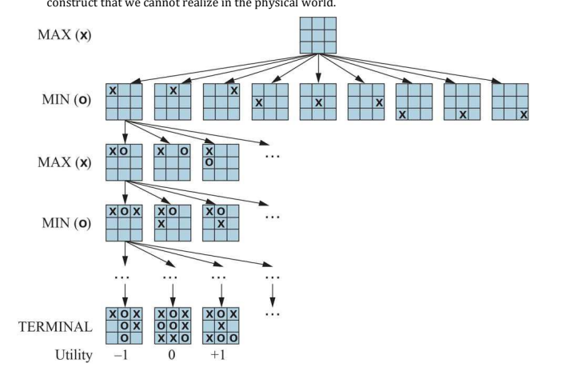
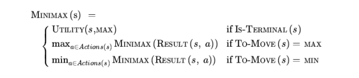
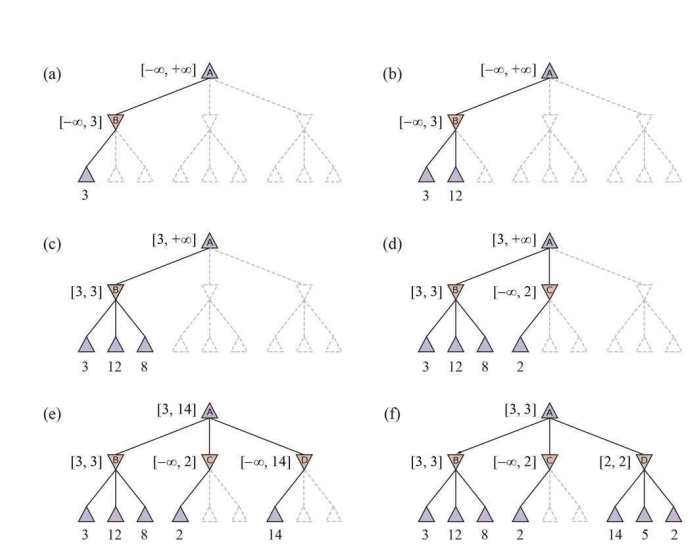
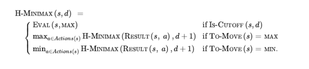
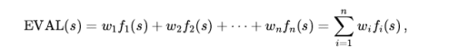

# Game Theory: Optimal Decisions and Alpha-Beta Search

This detailed guide covers **Game Theory**, **Optimal Decisions (Minimax)**, and **Alpha-Beta Search** in depth, breaking down every sub-topic found in your material. Each section includes a **Technical Analysis** (for exams) and a **Child-Friendly Explanation** (for intuition), along with algorithms and text-based diagrams.

***

## Topic 1: Game Theory in AI
**Technical Analysis**:
Game theory in AI analyzes competitive environments where multiple agents (players) have conflicting goals. The most common type studied is the **Deterministic, Two-Player, Zero-Sum Game**.
*   **Zero-Sum**: One player's gain is the other's loss. There is no "win-win". The total utility is constant (usually 0).
*   **Perfect Information**: Both players see the entire board (e.g., Chess, Go).
*   **Formal Elements**:
    1.  **$S_0$**: Initial state.
    2.  **TO-MOVE(s)**: Whose turn it is.
    3.  **ACTIONS(s)**: Legal moves.
    4.  **RESULT(s, a)**: New state after a move.
    5.  **IS-TERMINAL(s)**: True if game over.
    6.  **UTILITY(s, p)**: Final score (e.g., +1 win, 0 loss).

**Child-Friendly Explanation (The Tug-of-War)**:
Imagine a game of Tug-of-War.
*   **Zero-Sum**: If you pull the rope 1 meter to your side, your friend *loses* 1 meter. You can't both get the rope!
*   **Perfect Information**: You can see exactly where your friend is standing. No secrets.
*   **Goal**: You want to get the highest score (Win), and your friend wants you to get the lowest score (Lose).

***

## Topic 2: Optimal Decisions (Minimax Search)

### 2.1 The Minimax Algorithm
**Technical Analysis**:
MAX tries to maximize the utility, and MIN tries to minimize it. The **Minimax Value** of a state is the best achievable utility assuming **perfect play** from the opponent.
*   **MAX Node**: Value is the **Maximum** of its children.
*   **MIN Node**: Value is the **Minimum** of its children.
*   **Complexity**: Time $O(b^m)$, Space $O(bm)$ (where $b$=branching factor, $m$=max depth). Impractical for deep games like Chess without optimization.

**Child-Friendly Explanation (The Cake Split)**:
You (MAX) and your greedy brother (MIN) share a cake.
*   **Your Move**: You cut the cake into two pieces.
*   **His Move**: He chooses which piece *he* wants (leaving you the other one).
*   **Strategy**: If you cut one giant piece and one tiny piece, he will take the giant one, leaving you the tiny one. Bad!
*   **Optimal Decision**: You cut two equal pieces. Now, no matter what he picks, you get a decent piece. You "minimized" the damage he could do.

**Algorithm (Better Version)**:
```python
def minimax(state, depth, is_max):
    if depth == 0 or is_terminal(state):
        return evaluation(state)
    
    if is_max:
        max_eval = -infinity
        for move in get_moves(state):
            eval = minimax(make_move(state, move), depth - 1, False)
            max_eval = max(max_eval, eval)
        return max_eval
    else:
        min_eval = +infinity
        for move in get_moves(state):
            eval = minimax(make_move(state, move), depth - 1, True)
            min_eval = min(min_eval, eval)
        return min_eval
```

### 2.2 Multiplayer Games
**Technical Analysis**:
In games with 3+ players (A, B, C), a single value isn't enough. We use a **Utility Vector** $\langle v_A, v_B, v_C \rangle$.
*   At a node where player C moves, C chooses the action that maximizes the $3^{rd}$ component of the vector (their own score).
*   **Alliances**: Players in weak positions might cooperate (implicitly or explicitly) to attack a strong player, emerging from selfish optimization.

**Child-Friendly Explanation**:
Imagine a 3-player video game. If Player A is super strong, Players B and C might stop fighting each other and team up to beat A first. They do this selfishly to survive, not because they are friends!

***

## Topic 3: Alpha-Beta Pruning

### 3.1 The Concept
**Technical Analysis**:
Alpha-Beta Pruning returns the **exact same result** as Minimax but runs faster by ignoring (pruning) branches that don't affect the decision.
*   **$\alpha$ (Alpha)**: The best (highest) value MAX has found so far.
*   **$\beta$ (Beta)**: The best (lowest) value MIN has found so far.
*   **Pruning Condition**:
    *   **Beta Cutoff**: At a MAX node, if value $\geq \beta$, stop. (MIN won't let us get here).
    *   **Alpha Cutoff**: At a MIN node, if value $\leq \alpha$, stop. (MAX won't choose this path).

**Child-Friendly Explanation (The Shopping Trip)**:
You (MAX) want a cool toy. Dad (MIN) wants to spend the least money.
1.  Store A has a toy for **\$50**. You know you can get at least this. ($\alpha = 50$).
2.  Store B's first toy costs **\$20**.
3.  **STOP!** Don't check the rest of Store B. Dad will pick the \$20 toy (or something even cheaper). Since \$20 is worse than the \$50 you already found, you will never go to Store B.

### 3.2 Diagram (Text-Based)
```text
       [Root MAX] 
      /     |    
     /      |    (Pruned)
  [B: MIN] [C: MIN] ---X--- [D]
   /  \      /  
  3   12    2    (x, y skipped)
  
1. Root checks B. B sees 3 and 12. B picks 3. Root has Alpha=3.
2. Root checks C. C sees 2. 
3. Since 2 < 3, Root knows C is bad.
4. Root STOPS checking C's other children (x, y). They are PRUNED.
```

***

## Topic 4: Move Ordering & Advanced Search

### 4.1 Move Ordering
**Technical Analysis**:
The order in which you check moves matters. If you check the best moves first, Alpha-Beta is much more efficient ($O(b^{m/2})$).
*   **Killer Move Heuristic**: The move that caused a cutoff at the same depth in a previous search is likely to be good again. Try it first.
*   **Iterative Deepening**: Search depth 1, then 2, then 3... Use the best move from depth $d-1$ as the first guess for depth $d$.
*   **Transposition Tables**: A hash table (cache) storing previous board states so you don't re-analyze the same position reached via a different path.

**Child-Friendly Explanation**:
If you are looking for your lost keys, do you search the whole house randomly? No! You check the "most likely" places first (pockets, table). If you find them there, you save hours of searching. Move ordering is just "checking the best spots first."

### 4.2 Heuristic Alpha-Beta Search

**Technical Analysis**:
We can't search to the very end of Chess. We stop early and guess.
*   **H-MINIMAX**: Replaces `UTILITY(s)` with `EVAL(s)` when depth limit is reached.
*   **Cutoff Test**: Replaces `IS-TERMINAL(s)`. Returns true if depth > limit or time is up.

***

## Topic 5: Evaluation Functions


## **Topic 1: Evaluation Functions (Heuristics)**

### **1.1 Technical Explanation**
In complex games like Chess or Go, the game tree is too deep to reach a terminal state (Win/Loss) within a reasonable time. Therefore, the search must stop early at a non-terminal leaf node. We need a way to estimate the "utility" or "goodness" of that state.

This is done using a **Heuristic Evaluation Function**, denoted as `EVAL(s)`.

*   **Weighted Linear Function**: The most common mathematical form. The state $s$ is broken down into numerical features $f_i$, and each feature is assigned a weight $w_i$ based on its importance.
    \[
    \text{EVAL}(s) = w_1 f_1(s) + w_2 f_2(s) + \dots + w_n f_n(s)
    \]
*   **Features ($f_i$)**:
    *   **Material**: The raw count of pieces (e.g., White has 2 Rooks, Black has 1).
    *   **Mobility**: The number of legal moves available (more moves = better flexibility).
    *   **King Safety**: Distance of enemy pieces from the King.
    *   **Pawn Structure**: Penalties for doubled or isolated pawns.
*   **Non-Linearity**: Advanced functions account for synergy. For example, a pair of Bishops is often worth more than $2 \times$ (1 Bishop) because they cover both color diagonals together.

### **1.2 Child-Friendly Explanation: "The Fruit Basket Judge"**
Imagine there is a contest for the best fruit basket. The judge is a computer, but it doesn't have time to taste every fruit. It just looks at a photo and gives a score.

*   **The Features (What it counts)**:
    1.  **Apples**: Worth 1 point each.
    2.  **Bananas**: Worth 3 points each (because they are tastier).
    3.  **Rotten Spots**: Worth -10 points (very bad!).

*   **The Scoring**:
    *   **Basket A**: Has 5 Apples and 1 Banana.
        *   Score = $(5 \times 1) + (1 \times 3) = 8$.
    *   **Basket B**: Has 20 Apples but 1 Rotten Spot.
        *   Score = $(20 \times 1) + (1 \times -10) = 10$.
    *   **Result**: The computer picks Basket B because 10 is higher than 8.
*   **The Lesson**: The computer doesn't *know* if the fruit is actually good; it just does the math. If the math (weights) is wrong, the computer makes bad choices.

### **1.3 Code Example: Simple Chess Evaluation**

```python
def evaluate_board(board):
    # 1. Define Weights (Importance of each piece)
    piece_values = {
        'Pawn': 1,
        'Knight': 3,
        'Bishop': 3,
        'Rook': 5,
        'Queen': 9,
        'King': 200
    }
    
    score = 0
    
    # 2. Loop through all pieces on the board
    for piece in board.pieces:
        value = piece_values[piece.type]
        
        # 3. Add to score if it's OUR piece, subtract if ENEMY
        if piece.color == 'White': # Assuming we are White
            score += value
        else:
            score -= value
            
    # 4. Add Positional Bonus (Example: Control of center squares)
    score += count_center_control(board, 'White') * 0.5
    
    return score
```

***

## **Topic 2: Cutting Off Search (Common Problems)**

### **2.1 Sub-Topic: Quiescence Search**

#### **Technical Explanation**
Standard Minimax stops searching exactly when it hits the **Depth Limit** (e.g., depth 4).
*   **The Problem**: What if depth 4 occurs in the middle of a "wild" exchange?
    *   *Example*: I capture your Queen (Depth 3). You are *about* to capture my Queen back (Depth 4), but the search stops before you do it.
    *   The `EVAL` function sees I am up +9 points (I have your Queen, you haven't taken mine yet). It thinks I am winning easily. This is a **Noisy State**.
*   **The Solution**: **Quiescence Search**.
    *   When the depth limit is reached, check: "Is the board quiet?" (Are there any captures or checks possible?).
    *   If **No** (It's noisy): Continue searching **only** the capture moves until the board settles down.

#### **Child-Friendly Explanation: "The Jumping Photo"**
You want to measure how tall your friend is.
*   **Bad Cutoff**: You take the photo while your friend is jumping on a trampoline, high in the air.
    *   *Result*: The photo says he is 10 feet tall! This is wrong because he is "unstable."
*   **Quiescence**: You wait. You keep watching until he stops jumping and stands flat on the floor (Quiet State).
    *   *Result*: Now you measure him. He is 5 feet tall. Much more accurate.

#### **Algorithm Logic**
```python
def quiescence_search(state, alpha, beta):
    # 1. Stand Pat: What is the score if we stop right now?
    stand_pat = evaluate(state)
    
    # 2. Pruning: If standing pat is already too good, return it
    if stand_pat >= beta:
        return beta
    if stand_pat > alpha:
        alpha = stand_pat
        
    # 3. Only look at "Noisy" moves (Captures)
    for move in get_capture_moves(state):
        score = -quiescence_search(make_move(state, move), -beta, -alpha)
        
        if score >= beta:
            return beta
        if score > alpha:
            alpha = score
            
    return alpha
```

### **2.2 Sub-Topic: The Horizon Effect**

#### **Technical Explanation**
This error occurs when an unavoidable "bad event" (like losing a Rook) is going to happen at **Depth 6**. The computer is only looking to **Depth 5**.
*   The computer notices that if it sacrifices a Pawn now (Depth 3), the game changes slightly, and the Rook capture is delayed until **Depth 8**.
*   Since Depth 8 is beyond the "Horizon" (Depth 5), the computer cannot see it.
*   **The Mistake**: The computer thinks, "If I sacrifice the Pawn, the Rook is safe!"
*   **The Reality**: It loses the Pawn *and* eventually loses the Rook anyway. It damaged its position just to delay the bad news.

#### **Child-Friendly Explanation: "Hiding the Shoes"**
*   **The Bad Event**: You have a dentist appointment at 4:00 PM. You hate the dentist.
*   **The Horizon**: You can only plan your day until 5:00 PM.
*   **The Mistake**: At 3:55 PM, you hide your shoes. It takes 30 minutes to find them.
*   **Computer Logic**: "If I hide the shoes, 4:00 PM passes and I am still at home! I win! I beat the dentist!"
*   **Reality**: You didn't beat the dentist. You just pushed the appointment to 4:30 PM (which you can't see yet), and now your mom is mad that you hid your shoes. You lose twice.

***

## **Topic 3: Forward Pruning (Risky Search)**

### **3.1 Technical Explanation**
Standard Alpha-Beta pruning is **safe**; it only ignores moves that are provably worse. **Forward Pruning** is **aggressive**; it ignores moves that *seem* bad to save time, even though they *might* be good.

1.  **Beam Search**: instead of generating all child nodes, only generate the top $n$ most promising children according to the `EVAL` function.
2.  **PROBCUT (Probabilistic Cut)**: Uses statistics to predict if a move will cause a pruning cutoff. If the probability is high (e.g., 95%), it prunes immediately without checking.
3.  **Late Move Reduction (LMR)**: Assumes that your move ordering is good (best moves are first). It searches the first few moves at full depth, but searches the later moves (which are likely bad) at reduced depth (e.g., Depth - 2).

*   **Risk**: You might prune a "Genius Move" that looks bad at first glance (like a Queen sacrifice) but actually leads to a win.

### **3.2 Child-Friendly Explanation: "The Library Homework"**
You have to find a fact about "Lions" in the library.

*   **Safe Search (Alpha-Beta)**: You look at the index of every single book to make sure you don't miss anything. (Takes forever).
*   **Forward Pruning**: You say, "I am ONLY going to look in the 'Animals' section. I will completely skip the 'Cooking' and 'Space' sections."
    *   **Why?** Because Lions are usually in the Animals section. You finish your homework in 1 hour.
    *   **The Risk**: What if there was a cool fact about a "Lion-shaped Cake" hidden in the Cooking section? You missed it because you "pruned" that section without checking.

### **3.3 Algorithm Logic: Beam Search**

```python
def beam_search(state, depth, beam_width):
    if depth == 0:
        return evaluate(state)
    
    # 1. Get ALL possible moves
    all_moves = get_legal_moves(state)
    
    # 2. Score them roughly (Shallow guess)
    scored_moves = []
    for move in all_moves:
        score = evaluate(make_move(state, move))
        scored_moves.append((score, move))
        
    # 3. Sort best to worst
    scored_moves.sort(reverse=True)
    
    # 4. PRUNING: Only keep the top 'beam_width' (e.g., top 3)
    best_moves = scored_moves[:beam_width]
    
    # 5. Only search those top 3 deeply
    best_val = -infinity
    for score, move in best_moves:
        val = beam_search(make_move(state, move), depth-1, beam_width)
        best_val = max(best_val, val)
        
    return best_val
```

***

### **Summary Table**

| Concept | Technical Definition | Child-Friendly Analogy |
| :--- | :--- | :--- |
| **Evaluation Function** | $w_1 f_1 + w_2 f_2 \dots$ | Grading a fruit basket by counting apples. |
| **Quiescence Search** | Extending search in "noisy" states to avoid errors. | Waiting for a jumper to land before measuring height. |
| **Horizon Effect** | Stalling moves push bad events beyond search depth. | Hiding shoes to delay a dentist appointment. |
| **Forward Pruning** | Skipping "unlikely" moves to gain speed (Risky). | Only checking the "Animal" section for Lion facts. |